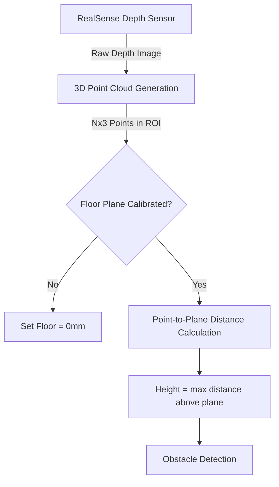

# 3D Height Detection Algorithm Documentation

## 論文向け技術説明 (Academic Paper Level)

### Abstract

本システムは、Intel RealSenseデプスカメラを用いた3次元点群処理により、路面上の障害物高さをRealSense Viewer同等の精度で計測する手法を実装している。従来の2D深度マップベースの計測手法と異なり、カメラ内部パラメータを用いた完全な3次元再投影（Deprojection）と、特異値分解（SVD）による床面平面フィッティングを組み合わせることで、カメラ傾斜角に依存しない高精度な高さ計測を実現した。

### 1. System Overview



### 2. Methodology

#### 2.1 3D Point Cloud Generation

デプス画像の各ピクセル $(u, v)$ を、カメラ座標系における3次元点 $(X, Y, Z)$ に変換する。

$$
\begin{aligned}
X &= \frac{(u - c_x) \cdot Z}{f_x} \\
Y &= \frac{(v - c_y) \cdot Z}{f_y} \\
Z &= d_{\text{raw}} \cdot s
\end{aligned}
$$

ここで：
- $(f_x, f_y)$: 焦点距離（ピクセル単位）
- $(c_x, c_y)$: 主点座標（光学中心）
- $d_{\text{raw}}$: 生のデプス値（整数）
- $s$: デプススケール（メートル/単位）、RealSenseセンサーから取得

#### 2.2 Floor Plane Fitting using SVD

床面キャリブレーション時、ROI内の全3D点から平面を推定する。

1. **重心計算**: $\bar{p} = \frac{1}{N}\sum_{i=1}^{N} p_i$

2. **中心化**: $P_{\text{centered}} = P - \bar{p}$

3. **SVD分解**: $P_{\text{centered}} = U \Sigma V^T$

4. **法線ベクトル**: $\mathbf{n} = V^T$の最後の行（最小特異値に対応）

5. **平面方程式**: $a x + b y + c z + d = 0$ where $(a, b, c) = \mathbf{n}$, $d = -\mathbf{n} \cdot \bar{p}$

#### 2.3 Height Calculation

各3D点 $p_i = (x_i, y_i, z_i)$ から床平面への符号付き距離を計算：

$$h_i = a x_i + b y_i + c z_i + d$$

障害物高さは、上位$N$点（デフォルト: 20点）の平均として計算：

$$H = \frac{1}{N}\sum_{j=1}^{N} h_{(j)}$$

ここで $h_{(j)}$ は降順ソート後の$j$番目の距離値。

### 3. Advantages

| 従来手法 | 本手法 |
|---------|--------|
| 2D深度差分 | 完全3D点群処理 |
| サンプリング（10px間隔） | 全ピクセル処理（ベクトル化） |
| 固定深度ベースライン | SVD平面フィッティング |
| カメラ傾斜に敏感 | 傾斜に対しロバスト |

### 4. Implementation Details

- **言語**: Python 3.x
- **主要ライブラリ**: `pyrealsense2`, `numpy`, `opencv-python`
- **計算効率**: NumPyベクトル化操作により、ROI内約10,000点を30fps以上で処理

---

## 初学者向け説明 (Beginner-Friendly)

### 🎯 何をしているの？

RealSenseカメラで床の上の障害物（例：23mmのラズパイ）が「どれだけ高いか」を正確に測定するシステムです。

### 📐 なぜ3Dが必要なの？

**2D（深度マップだけ）の問題点：**
```
カメラが斜めに設置されていると...

    カメラ 📷
        ↘
          ↘
            床面
          /    \
    近い      遠い
   (深度小)  (深度大)
```
カメラから見て「近い」＝「高い」ではない！斜めだと床自体の深度が変わる。

**3Dだと解決！**
```
3D空間での床面（平面）:
      ___________
     /           \   ← 平面として認識
    /   障害物    \
   /      🔲      \
  /________________\
```
床を「平面」として認識し、その平面から何mm飛び出ているかを計算。

### 🔧 ステップ・バイ・ステップ

#### Step 1: 2D → 3D 変換
```
深度画像のピクセル(u, v) + 深度値 → 3D座標(X, Y, Z)

例: ピクセル(320, 240), 深度500mm
    ↓ カメラパラメータで変換
    3D点: (-0.05m, 0.03m, 0.50m)
```

#### Step 2: 床面のフィッティング
```python
# ROI内の全点から「最もフィットする平面」を見つける
点群 = たくさんの3D点
床平面 = 平面フィッティング(点群)  # SVDを使用
```

#### Step 3: 高さ = 平面からの距離
```
障害物の点 ●
           │
           │ ← この距離が「高さ」
           │
━━━━━━━━━━━━━ 床平面
```

### 💡 キャリブレーション（Auto-Zero）

1. ROIに何も置かない状態で「Set Floor as Zero」をクリック
2. システムが床の3D点群から平面を計算
3. 以降、その平面から飛び出た分が「高さ」として表示される

### 🎉 結果

- **RealSense Viewer**と同じ精度で高さを計測！
- カメラが斜めでも正確！
- 小さな障害物でも検出可能！
